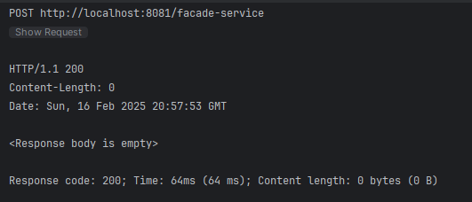
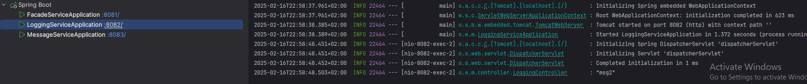
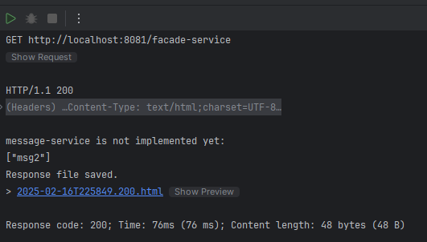
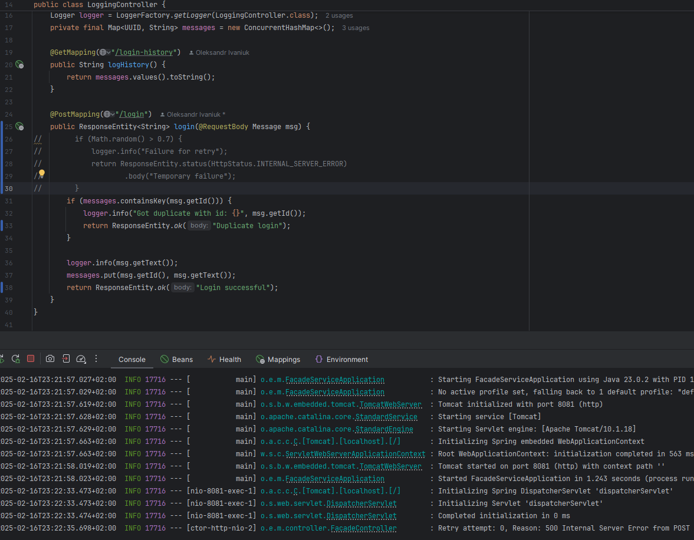
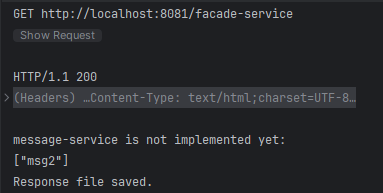
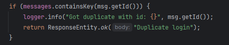

# oleksandr-ivaniuk-architecture-lab1

  
### Here are the logs

  

### On the following images you can see how retry is working with simulation of error in commented code.

### Also here is deduplication logic
