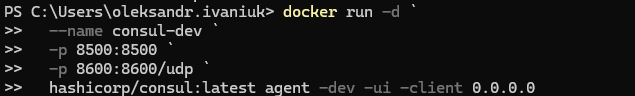
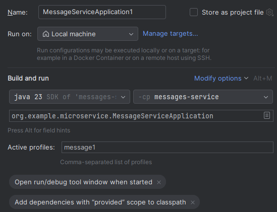
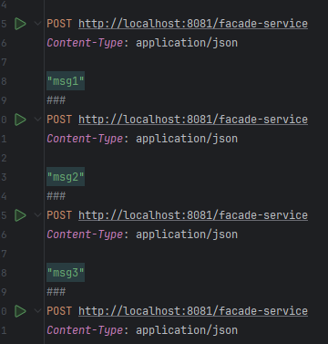
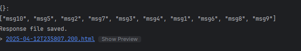

# Lab4

## Запустити 3 екземпляри logging-service і 2 екземпляри message-service
  
Щоб так запустити потрібно в конфігурації додати профілі таким чином:  
  
  

## Записати 10 повідомлень (не вмикаючи message-service)
  
  
І отримав таке на запит GET
  

