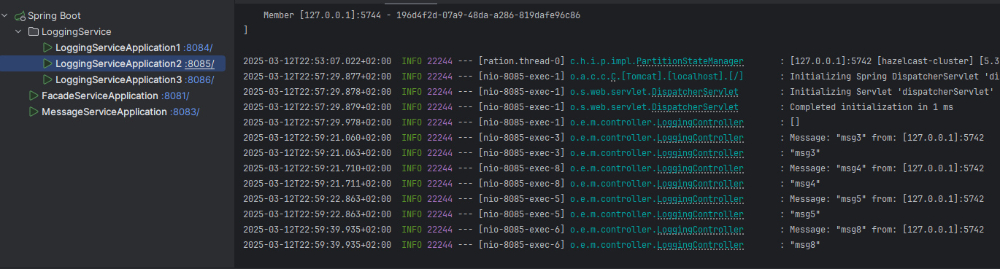
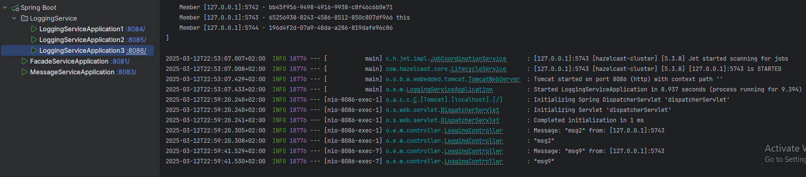
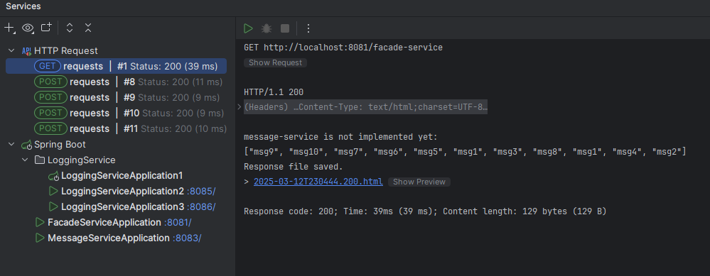
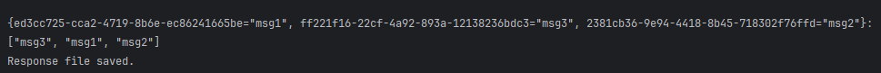
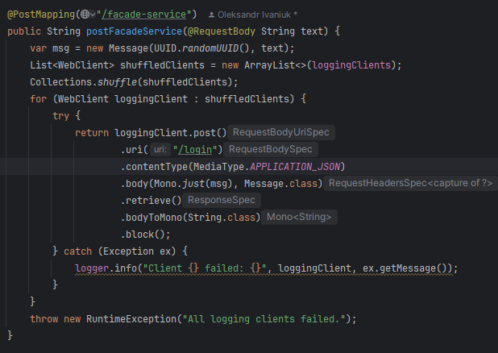
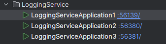
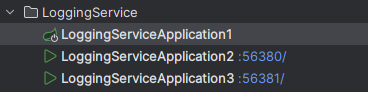
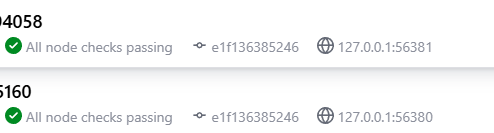

# Lab5

#### Запустив consule

### Всі мікросервіси мають самостійно динамічно реєструватись при старті у Consul, кожного з сервісів може бути запущено кілька екземплярів (це буде відображатись як кількість instances на UI):
#### Запустив всі сервіси через spring  

#### В Consule одразу видно всі сервіси і що вони запущені

### При звертанні facade-service до logging-service та messages-service, IP-адреси (і порти) мають зчитуватись facade-service з Consul. Немає бути задано в коді чи конфігураціях статичних значень адрес.
#### Тепер береться сервіс в фасаді через Consule

#### Також і до message-service

### Налаштування для клієнтів Hazelcast мають зберігатись як key/value у Consul і зчитуватись logging-service
#### Переніс конфігурації в key/value, тепер назва мапи дл logging-service звичтується з Consule

### Налаштування для Message Queue (адреса, назва черги, …) мають зберігатись як key/value у Consul і зчитуватись facade-service та messages-service
#### Тепер всі налаштування черги зберігаються в key/value, що можна побачити на попередньому скріні і на наступному

#### Також от їх використання

### Продемонструвати, що у випадку відключення екземпляру певного мікросервісу, це буде відображатись у Consul (відключений екземпляр сервісу змінить статус) , а виклики будуть перенаправлятись до інших працюючих екземплярів.  
#### Демонстрація що все працює

#### Коли відключаю один сервіс логування він зникає з консула

#### При цьому все інше далі продовжує працювати