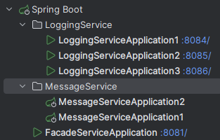
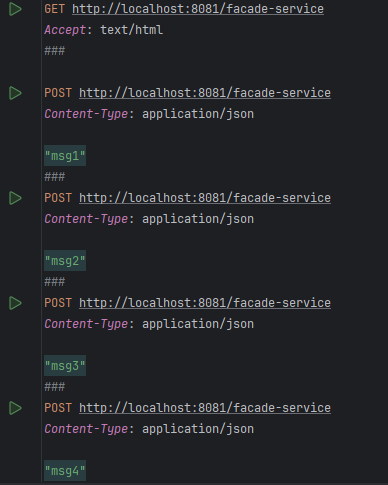
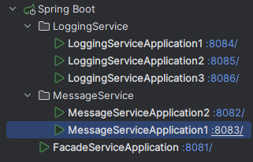
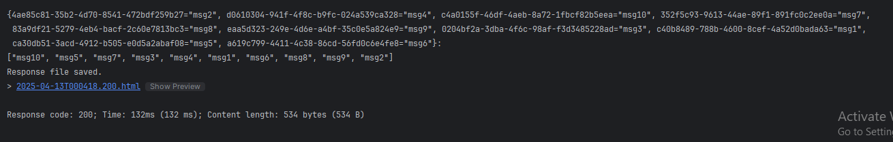

# Lab4

## Запустити 3 екземпляри logging-service і facade
  
Щоб так запустити потрібно в конфігурації додати профілі таким чином:  
  
  

## Записати 10 повідомлень (не вмикаючи message-service)
  
  
І отримав таке на запит GET
  
  
## Тепер включаємо message-service
  
  
І даємо запит GET  
  
  
Бачимо що в черзі все зберігалось і після увімкнення message сервісів все записалось.

